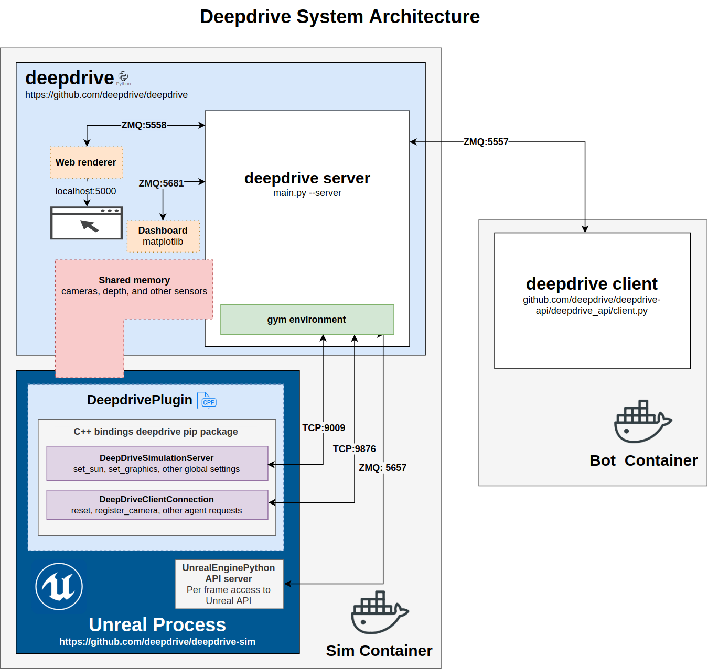

# Deepdrive [](https://travis-ci.org/deepdrive/deepdrive)

The easiest way to experiment with self-driving AI

## Simulator requirements

- Linux
- Python 3.6+
- 10GB disk space
- 8GB RAM

## Optional - baseline agent requirements

- CUDA capable GPU (tested and developed on 970, 1070, and 1060's)
- 1.7 <= Tensorflow < 2.0 [See Tensorflow install tips](#tensorflow-install-tips)

## Install

```
git clone https://github.com/deepdrive/deepdrive
cd deepdrive
```

> Optional - Activate the Python conda env or virtualenv with Tensorflow is installed, then

> Note: If you use Anaconda (we recommend Miniconda) - only use `pip install` in your deepdrive conda environment, never `conda install`

```
python install.py
```

#### Cloud

[Cloud setup instructions](/docs/tutorial/cloud/cloud.md)

## Usage

A minimal agent can be run with

```python
import sim
# map can be
env = sim.start(

    # map can be canyons, kevindale, kevindale_bare, or jamestown
    map='kevindale_bare',

    # scenario can be 0 => 5
    scenario_index=1
)
forward = sim.action(throttle=0.75, steering=0, brake=0)
done = False
while not done:
    observation, reward, done, info = env.step(forward)
env.close()
```

### Observation data

All values returned in the observation keep Unreal conventions, specifically
* All distances are in centimeters per Unreal's default data type
* All rotations / angular values are in the order of roll, pitch, yaw in degrees
* x,y,z is forward, right, up

```

{ 
  
  'acceleration': array([-264.26913452, -227.578125  ,  105.16122437]),
  'angular_acceleration': array([210980.234375, 105423.765625,  38187.28125 ]),
  'angular_velocity': array([2.59908962, 3.8214705 , 1.87282801]),
  'brake': 0.0,
  'camera_count': 1,
  'cameras': [{  'aspect_ratio': 1.0,
                 'capture_height': 227,
                 'capture_width': 227,
                 'depth_data': array([0.9995  , 0.9995  , 0.9995  , ..., 
                     0.005146, 0.005146, 0.005146], dtype=float16),
                 'horizontal_field_of_view': 1.7654,
                 'id': 1,
                 'image': array([[[ 40.,  78., 110.] ..., dtype=float32),
                 'image_data': array([0.283  , 0.557  , 0.82, 
                     ..., 0.02321, 0.02574, 0.02599], dtype=float16),
                 'image_raw': array([[[144, 195, 233]..., dtype=uint8),
                 'type': 0
              }],
  'capture_timestamp': 4132.511303506,
  'dimension': array([514.99609375, 514.99609375,  91.1796875 ]),  # Vehicle dimensions
  'distance_along_route': 70658.828125,  # centimeters of progress made along route to destination
  'distance_to_center_of_lane': 1038.8463134765625,  # centimeters to center of lane
  'world': { 'vehicle_positions': [ [ -15800.8193359375,
                                      38030.23828125,
                                      19894.62890625],
                                    [ -13854.9384765625,
                                      39296.91015625,
                                      20041.6484375],
                                    [ -10323.2744140625,
                                      39767.69921875,
                                      20409.265625],
                                    [ -6528.05810546875,
                                      38875.75390625,
                                      21034.83984375],
                                    [ 4577.29150390625,
                                      36155.37890625,
                                      22704.166015625]]},
  'distance_to_next_agent': 326125.625, # Next agent in our lane 
  'distance_to_next_opposing_agent': -1.0,  # Next agent in opposite lane
  'distance_to_prev_agent': 30758.2734375,   # Next agent in our lane
  'forward_vector': array([-0.8840133 , -0.4375411 , -0.16455328]),
  'gym_action': [0, 1, 0, 0, True],
  'gym_done': False,
  'gym_reward': -2.4653405387152016,
  'handbrake': 0,
  'is_game_driving': 0,
  'is_passing': 0,
  'is_resetting': 205,
  'lap_number': 0,
  'last_collision': { 'collidee_velocity': array([0., 0., 0.]),
                      'collision_location': 'rear_right_fender',
                      'collision_normal': array([0., 0., 0.]),
                      'time_since_last_collision': 0.0,
                      'time_stamp': 4105.741911045,
                      'time_utc': 1562958070},
  'position': array([-10163.55371094,  17115.17382812,  22500.29492188]),
  'right_vector': array([-0.8840133 , -0.4375411 , -0.16455328]),
  'rotation': array([ 0.10010731, -0.16530512, -2.68199444]),
  'route_length': 273551.21875,
  'episode_return': { 'avg_kph': 0,
             'closest_vehicle_cm': 15812.662932649602,
             'closest_vehicle_cm_while_at_least_4kph': 15812.662932649602,
             'cm_along_route': 18730.72265625,
             'collided_with_vehicle': False,
             'collided_with_non_actor': True,
             'end_time': '1969-12-31T16:00:00-08:00',
             'episode_time': 11.5,
             'gforce_penalty': 90.68476390028613,
             'got_stuck': False,
             'lane_deviation_penalty': 255.7695629358121,
             'max_gforce': 0.8785649610557551,
             'max_kph': 138.7572978515625,
             'max_lane_deviation_cm': 1038.8463134765625,
             'num_steps': 0,
             'prev_progress_pct': 6.70844576752594,
             'progress_pct': 6.8472451856879175,
             'progress_reward': 0.0,
             'route_length_cm': 273551.21875,
             'speed_reward': 371.6081579415893,
             'start_time': '2019-07-12T12:00:59.003417-07:00',
             'time_penalty': 0.0,
             'total': 25.15383110549117,
             'wrong_way': False},
  'speed': 3854.369384765625,
  'steering': 0.0,
  'throttle': 1.0,
  'up_vector': array([-0.8840133 , -0.4375411 , -0.16455328]),
  'velocity': array([-3404.32958984, -1700.12841797,  -613.90289307]),
  'view_mode': 'normal',
}
```

Additional observation data can be exposed without compiling C++ or Blueprints by accessing the Unreal API with [UnrealEnginePython](https://docs.deepdrive.io/v/v3/docs/tutorial/uepy/uepy). 

### Examples

#### Synchronous forward-agent

```
python example_sync.py
```

* [Remote agent example](https://github.com/deepdrive/forward-agent) - operates over the network using the [deepdrive remote api](https://github.com/deepdrive/deepdrive-api)

#### Mnet2 baseline agent
```
python main.py --mnet2-baseline --experiment my-baseline-test
```

#### Built-in C++ [FSM](https://github.com/deepdrive/deepdrive-sim/tree/c2d26a38692f1db61d48986263b20721ab136fe3/Plugins/DeepDrivePlugin/Source/DeepDrivePlugin/Private/Simulation/Agent/Controllers/LocalAI/States) / [PID](https://github.com/deepdrive/deepdrive-sim/blob/v3/Plugins/DeepDrivePlugin/Source/DeepDrivePlugin/Private/Simulation/Agent/Controllers/DeepDriveAgentSteeringController.cpp) agent that can overtake in the canyons map
```
python main.py --path-follower --experiment my-path-follower-test
```

#### Record training data for imitation learning / behavioral cloning
```
python main.py --record --jitter-actions --sync
```

Note that we recorded the baseline dataset in sync mode which is much slower than async mode. 
Async mode _probably_ is fine to record in, we just haven't got around to trying it out for v3.

Optional: Convert to HDF5 files to tfrecords (for training MNET2)
```
python main.py --hdf5-2-tfrecord
```

#### Train on recorded data
```
python main.py --train [--agent dagger|dagger_mobilenet_v2|bootstrapped_ppo2] --recording-dir <your-hdf5-or-tfrecord-dir>
```

#### Train on our dataset

Grab the [dataset](#dataset)
```
python main.py --train --recording-dir <the-directory-with-the-dataset> [--agent dagger|dagger_mobilenet_v2|bootstrapped_ppo2]
```

#### Tensorboard

```
tensorboard --logdir="<your-deepdrive-home>/tensorflow"
```

Where `<your-deepdrive-home>` below is by default in `$HOME/Deepdrive` and can be configured in `$HOME/.deepdrive/deepdrive_dir`

#### Running unit tests

```
pytest tests/unit_tests/test_sanity.py
```

### Key binds 

* <kbd>Esc</kbd> - Pause (Quit in Unreal Editor)
* <kbd>Enter</kbd> - Pause with no menu
* <kbd>P</kbd> - Pause in Unreal Editor
* <kbd>1</kbd> - Chase cam
* <kbd>2</kbd> - Orbit (side) cam
* <kbd>3</kbd> - Hood cam
* <kbd>4</kbd> - Free cam (use WASD to fly)
* <kbd>Space</kbd> - Handbrake
* <kbd>Alt+Tab</kbd> - Control other windows / Show mouse
* <kbd>`</kbd> - Unreal console - do things like `stat FPS` 
* <kbd>M</kbd> - Drive the car with the keyboard WASD - be sure sync is off - Also known issue: Only works in path-follower mode right now
* <kbd>Ctrl-number</kbd> - Change sun position - works for 1 => 7
* <kbd>B</kbd> - Show vehicle bounding boxes
* <kbd>N</kbd> - Show vehicle collision boxes
* <kbd>Page Up</kbd> - Next vehicle
* <kbd>Page Down</kbd> - Prev vehicle


## Benchmark

Agents are automatically graded via [Botleague](https://deepdrive.voyage/leaderboard)

## Dataset

100GB (8.2 hours of driving) of camera, depth, steering, throttle, and brake of an 'oracle' path following agent. We rotate between three different cameras: normal, wide, and semi-truck - with random camera intrisic/extrinsic perturbations at the beginning of each episode (lap). This boosted performance on the benchmark by 3x. We also use DAgger to collect course correction data as in previous versions of Deepdrive.

1. Get the [AWS CLI](https://github.com/aws/aws-cli)
2. Ensure you have 104GB of free space
3. Download our dataset of mixed Windows (Unreal PIE + Unreal packaged) and Linux + variable camera and corrective action recordings 
(generated with `--record`)
```
cd <the-directory-you-want>
aws s3 sync s3://deepdrive/data/baseline_tfrecords .
```
or for the legacy HDF5 files for training AlexNet
```
aws s3 sync s3://deepdrive/data/baseline .
```

If you'd like to check out our Tensorboard training session, you can download the 1GB
[tfevents files here](https://d1y4edi1yk5yok.cloudfront.net/tensorflow/mnet2_baseline_training_and_eval.zip),
unzip, and run

```
tensorboard --logdir <your-unzipped-dir>
```

and checkout [this view](http://localhost:6006/#scalars&_smoothingWeight=0.935&runSelectionState=eyIyMDE4LTA3LTE5X18wNS01My0yN1BNIjp0cnVlLCIyMDE4LTA3LTE5X18wNS01MC01NFBNIjp0cnVlfQ%3D%3D&_ignoreYOutliers=false&tagFilter=error)
, which graphs wall time.

## Architecture



## Frame rate issues on Linux

If you experience low frame rates on Linux, you may need to install NVIDIA’s display drivers including their OpenGL drivers. We recommend installing these with CUDA which bundles the version you will need to run the baseline agent. Also, make sure to [plugin your laptop](https://help.ubuntu.com/community/PowerManagement/ReducedPower). If CUDA is installed, skip to testing [OpenGL](#opengl).

## Tensorflow install tips

- Make sure to install the CUDA / cuDNN major and minor version the Tensorflow instructions specify.  i.e. CUDA 9.0 / cuDNN 7.3 for Tensorflow 1.12.0. These will likely be older than the latest version NVIDIA offers. You can see all [CUDA  releases here](https://developer.nvidia.com/cuda-toolkit-archive).
- Use the packaged install, i.e. deb[local] on Ubuntu, referred to in [this guide](http://docs.nvidia.com/cuda/cuda-installation-guide-linux/index.html)
- If you are feeling dangerous and use the runfile method, be sure to follow [NVIDIA’s instructions](http://docs.nvidia.com/cuda/cuda-installation-guide-linux/index.html) on how to disable the Nouveau drivers if you're on Ubuntu.
- On Windows, use standard (non-CUDA packaged) display drivers which meet the min required. When installing CUDA, do a custom install and uncheck the display driver install.

## OpenGL

`glxinfo | grep OpenGL` should return something like:
```
OpenGL vendor string: NVIDIA Corporation
OpenGL renderer string: GeForce GTX 980/PCIe/SSE2
OpenGL core profile version string: 4.5.0 NVIDIA 384.90
OpenGL core profile shading language version string: 4.50 NVIDIA
OpenGL core profile context flags: (none)
OpenGL core profile profile mask: core profile
OpenGL core profile extensions:
OpenGL version string: 4.5.0 NVIDIA 384.90
OpenGL shading language version string: 4.50 NVIDIA
OpenGL context flags: (none)
OpenGL profile mask: (none)
OpenGL extensions:
OpenGL ES profile version string: OpenGL ES 3.2 NVIDIA 384.90
OpenGL ES profile shading language version string: OpenGL ES GLSL ES 3.20
OpenGL ES profile extensions:
```
You may need to disable secure boot in your BIOS in order for NVIDIA’s OpenGL and tools like nvidia-smi to work. This is not Deepdrive specific, but rather a general requirement of Ubuntu’s NVIDIA drivers.


## Development

To run tests in PyCharm, go to File | Settings | Tools | Python Integrated Tools and change the default test runner 
to `pytest`.

Also, disable SciView per [this answer](https://stackoverflow.com/a/48421532/134077).
